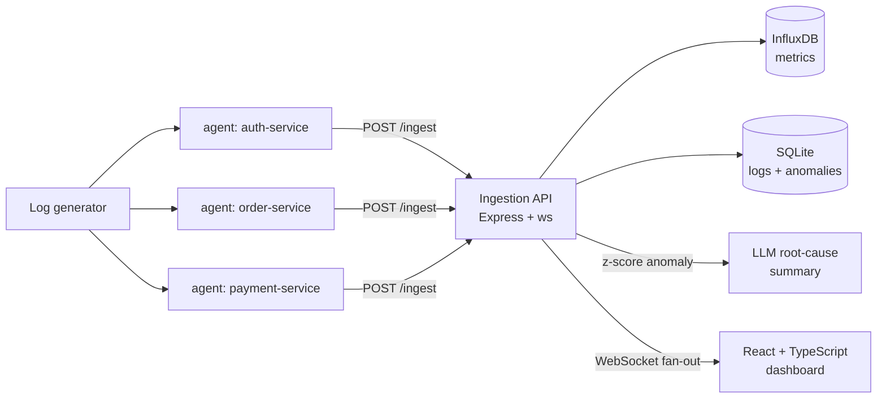

# PulseBoard

Real-time microservices observability platform with live metric streaming, statistical anomaly detection, and LLM-generated root-cause summaries.

Lightweight Node.js agents sample CPU/memory and tail service logs, shipping them to an Express ingestion API that persists metrics to InfluxDB (time-series) and logs to SQLite, and fans events out to a React + TypeScript dashboard over WebSockets. A rolling z-score detector flags CPU anomalies and triggers an LLM pipeline (Gemini/OpenAI/Anthropic, with a mock fallback) that correlates each spike with recent error logs to produce a one-sentence root-cause summary. The whole stack runs under Docker Compose.

## Architecture



## Tech stack

- **Frontend**: React 18, TypeScript (strict), Vite, native WebSocket client; wire contracts modeled as discriminated unions with runtime-validated parsing (`dashboard/src/types.ts`)
- **Backend**: Node.js, Express, `ws` WebSocket fan-out, REST API with input validation
- **Data**: InfluxDB 2.x (time-series metrics, Flux queries), SQLite (indexed log/anomaly storage)
- **AI**: pluggable LLM providers (Gemini / OpenAI / Anthropic) for anomaly root-cause summaries, with a deterministic mock for offline dev
- **Detection**: rolling-window z-score over per-service CPU samples
- **Infra**: Docker Compose (6 services), chaos-mode agents for fault injection; the API degrades gracefully when InfluxDB is unavailable

## Prereqs

- Docker Desktop (for the full stack)
- Node.js 20+ (for local dev runs)

## Quick start (Docker Compose)

```bash
docker compose up --build
```

Open the dashboard at http://localhost:5173

Notes:
- InfluxDB is initialized with org/bucket `pulseboard` and token `pulseboard-token`.
- The log generator writes INFO/WARN/ERROR lines to `./logs` inside the agent container.

## LLM setup (optional)

Gemini is supported and the default model in compose is `gemini-1.5-flash`.

To enable real summaries, add these to the `ingestion-api` service in `docker-compose.yml`:

```yaml
LLM_PROVIDER: gemini
LLM_MODEL: gemini-1.5-flash
GEMINI_API_KEY: your_key
```

You can also use OpenAI or Anthropic by setting `LLM_PROVIDER` and the matching API key.

## Local dev (without Docker)

### InfluxDB

Start an InfluxDB 2.x instance and set envs for the API:

```bash
export INFLUX_URL=http://localhost:8086
export INFLUX_ORG=pulseboard
export INFLUX_BUCKET=pulseboard
export INFLUX_TOKEN=your_token
```

### Ingestion API

```bash
cd ingestion-api
cp .env.example .env
npm install
npm run start
```

### Agent(s)

```bash
cd agent
npm install
node src/agent.js --config configs/auth-service.json
node src/agent.js --config configs/order-service.json
node src/agent.js --config configs/payment-service.json
```

### Log generator

```bash
cd agent
node src/log-generator.js
```

Optional envs:

```bash
export LOG_SERVICES=auth-service,order-service,payment-service
export LOG_INTERVAL_MS=2000
export LOG_DIR=./logs
```

### Dashboard

The dashboard is a React + TypeScript app (strict mode) built with Vite.

```bash
cd dashboard
npm install
npm run dev
```

Set the WebSocket URL if the API is not on localhost:

```bash
export VITE_WS_URL=ws://localhost:4000
```

Other scripts:

```bash
npm run typecheck   # tsc --noEmit
npm run build       # typecheck + production build
```

The data contracts for the WebSocket feed and REST responses are typed in
`dashboard/src/types.ts` — update it alongside any change to the API's
payload shapes.

## API

### REST endpoints

- `POST /ingest` — agents push `{ service_name, timestamp, metrics: { cpu, memory }, log_lines }`; responds `{ ok, anomaly }` where `anomaly` is set if the sample tripped detection
- `GET /metrics/:service?minutes=10` — `{ service, points }`; each point is `{ timestamp, cpu, memory }` with an ISO-8601 timestamp and nullable fields
- `GET /logs/:service?level=ERROR&limit=200` — `{ service, logs }`, newest first
- `GET /anomalies?service=auth-service&limit=100` — `{ anomalies }`, newest first
- `GET /health` — `{ ok: true }`

### WebSocket (ws://localhost:4000)

Every frame is JSON with a `type` discriminant:

| `type` | `data` | Sent |
| --- | --- | --- |
| `hello` | — (`message` string) | once, on connect |
| `metrics` | `{ service_name, cpu, memory, timestamp }` | on every ingest |
| `log_batch` | array of `{ service_name, level, message, timestamp }` | when an ingest includes log lines |
| `anomaly` | `{ service_name, z_score, cpu, memory, summary, timestamp }` | when CPU z-score exceeds 2.5 |

Log `level` is always one of `ERROR`, `WARN`, `INFO`. WebSocket timestamps are
epoch milliseconds (unlike the ISO strings from `GET /metrics/:service`).
